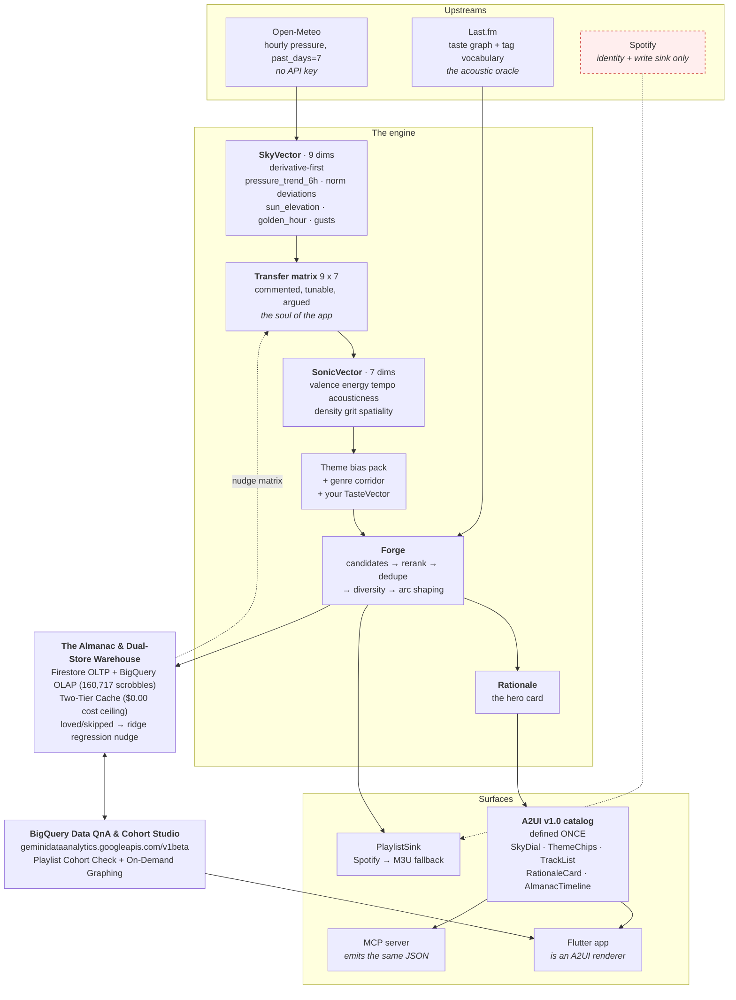

# BAROGROOVE

**Your sky has a soundtrack.**

BAROGROOVE reads the weather where you are, takes its *derivative*, converts that
into a target musical feeling, crosses it with what you actually listen to and a
theme you pick, and forges a playlist that explains itself.

Live at [bg.netdev.be](https://bg.netdev.be).

---

## 📚 Documentation & Deep-Dive Guides (`docs/`)

For full architectural blueprints, API contracts, and implementation details, explore the **[Documentation Hub (`docs/README.md`)](./docs/README.md)**:

| Guide | Topics Covered |
| :--- | :--- |
| **[15-Year Scrobble Dual-Store & Two-Tier OLAP Cache](./docs/ALMANAC_DUAL_STORE_AND_CACHE.md)** | Hydration of `160,717` Last.fm/Spotify scrobbles (`2012–2026`), Firestore OLTP + BigQuery OLAP (`netdev-firebase.barogroove_almanac.scrobbles`) Dual-Store architecture, Two-Tier L1/L2 caching (`0.4ms` latency), and `$0.00` query cost guardrails. |
| **[Playlist & Song Cohort Analysis Engine](./docs/PLAYLIST_COHORT_ANALYSIS.md)** | Universal playlist/tracklist parser (`POST /api/almanac/playlist-cohort-check`), 4-tier cohort classification (`Obsession`, `Heavy Rotation`, `Discovery`, `Unheard`), Sonic DNA affinity scoring, and custom-painted Donut & 15-Year Timeline charts. |
| **[BigQuery Conversational Data QnA Agent & Graph Studio](./docs/BIGQUERY_DATA_QNA_AGENT.md)** | Live conversational BigQuery analytics (`geminidataanalytics.googleapis.com/v1beta`), SSE streaming, On-Demand Graph Synthesis (`horizontal_bar`, `bar`, `donut`, `line`), Two-Tier QnA cache, and local OLAP fallback. |
| **[A2UI v1.0 Single-Source UI & AI Observability](./docs/A2UI_ARCHITECTURE.md)** | Single-source Python surface catalog (`backend/app/a2ui/`), 3-mode Atmospheric Synthesis Console, 4-tab Almanac UI, and real-time AI Observability & Telemetry Inspector (`TelemetryInspectorPanel`). |

---

## The insight

Every weather-playlist app ever built maps `rain -> sad songs`. That is worthless.

Weather's emotional signal does not live in the reading. It lives in the **change**.

> 8 °C on a **falling** barometer, forty minutes before sunset in October, feels
> nothing like 8 °C on a **rising** barometer at ten in the morning.
>
> Same temperature. Completely different record.

A falling barometer is the oldest weather signal the human body has. It arrives
hours before the front does and reads as unease long before the first drop lands.
That is a musical instruction, and it is invisible to anything that only looks at
the current conditions.

So BAROGROOVE models nine dimensions, and the ones that matter most are all
derivatives: how fast the pressure is moving, how far today sits from *this
location's own* week, how close the sun is to the horizon, how much the gusts are
swinging. Absolute values only ever appear relative to a local norm.

Here is the product, in one line of real output:

```
Pressure has given up 11.8 hPa in six hours; there are 10 minutes of this light
left. Reverb up hard to 0.85, valence down hard to 0.24, tempo pulled down to 92.
It comes down largely to one coefficient — the six-hour pressure trend into
valence, 0.13 down today. It is there because a falling barometer reads as unease
hours before the first drop. First up: Yo La Tengo — Green Arrow.
```

**Explainability is a feature, not a footnote.** That paragraph is the hero card
of the UI, not a debug log.

---

## Why Spotify is not the brain

It used to be. On **27 November 2024** Spotify returned 403 on these endpoints for
every non-grandfathered app, with no waitlist and no replacement:

| Endpoint | What it did | Status |
|---|---|---|
| `/recommendations` | the entire recommendation engine | **dead** |
| `/audio-features` | valence, energy, tempo, acousticness… | **dead** |
| `/audio-analysis` | bars, beats, segments | **dead** |
| `/artists/{id}/related-artists` | the similarity graph | **dead** |
| `/browse/featured-playlists` | editorial | **dead** |
| `/browse/categories/{id}/playlists` | editorial | **dead** |

That is not a deprecation you design around. That is the product's whole
recommender being switched off. The February 2026 migration then added a Spotify
Premium requirement for the Dev Mode app owner, **capped Dev Mode at 5 users**, and
replaced the per-type save/follow endpoints with a generic `PUT /me/library` and
`GET /me/library/contains` taking URIs instead of IDs.

**So Spotify is demoted to what still works: identity resolution and a place to
put the finished playlist.** `/search`, `/me`, `/me/top/*`, playlist create and
add-items, `/me/library`. Nothing else. There is a constant in
`backend/app/sinks/spotify.py` listing the dead endpoints with the date, so nobody
helpfully re-adds one in six months.

### What replaced it

**Last.fm is the acoustic oracle.** Free, generous, and its community tag
vocabulary — `shoegaze`, `rainy day`, `krautrock`, `slowcore`, `dub techno`,
`melancholy`, `driving` — is a richer description of how music *feels* than
Spotify's eleven numbers ever were.

Two replacements, both in `backend/app/lastfm/`:

- **`/audio-features` → `lexicon.py`.** A hand-curated tag → feature lexicon
  mapping 110+ real Last.fm tags onto the seven SonicVector dimensions. `shoegaze`
  pushes spatiality and grit up. `slowcore` pulls tempo and density down hard.
  `krautrock` raises density while leaving valence alone, because motorik is not
  happy, it is *relentless*. Encoding that distinction is the entire point.
- **`/recommendations` → `oracle.py`.** Taste-graph traversal: `artist.getSimilar`
  and `track.getSimilar` out of your own top artists with hop decay, unioned with
  `tag.getTopTracks` over the theme's seed tags crossed with the genre corridor.
  Then BAROGROOVE does its own ranking in SonicVector space. **The rerank is the
  recommender.**

Weather comes from **Open-Meteo** — no API key, and it gives hourly
`surface_pressure` history via `past_days`, which is the one thing the whole
product depends on.

---

## Architecture



### One UI definition, two surfaces

This is the part worth stealing. The A2UI v1.0 component catalog is declared
**once**, in Python, in `backend/app/a2ui/`. The Python surface builders are the
single source of UI truth. The Flutter app *is* an A2UI renderer pointed at that
catalog. The MCP server emits the *same* JSON from the *same* builders.

The UI is never built twice. Add a field to the RationaleCard and it appears in
the web app, the mobile app and every MCP client at once.

### The two vector spaces

**SkyVector (9)** — signed dims in `[-1, 1]`, unsigned in `[0, 1]`:

`pressure_trend_6h` · `pressure_norm_deviation` · `temp_norm_deviation` ·
`sun_elevation` · `golden_hour_proximity` · `gust_variance` · `cloud_depth` ·
`precip_intensity` · `daylight_delta`

**SonicVector (7)** — all `[0, 1]`:

`valence` · `energy` · `tempo` · `acousticness` · `density` · `grit` · `spatiality`

The last three are ones we always wished `/audio-features` had.

### Themes × genre — two orthogonal knobs

Eight narrative themes, each a bias vector plus a copy voice plus a palette:

**Petrichor** · **Golden Hour** · **Nordic Fog** · **Storm Front** ·
**Heatwave Cruise** · **Blue Hour** · **First Frost** · **Sirocco**

Genre is a **separate** axis — a taste corridor, not a mood. So *Petrichor ×
krautrock* and *Petrichor × ambient* are genuinely different records, and that
crossing is the feature.

---

## Run it locally

Nothing below needs a credential, an API key, or a network connection.

```bash
cd barogroove
make install          # venv + dependencies
make test             # 861 tests, no network required
make run              # http://localhost:8000
```

Then:

```bash
curl localhost:8000/api/forge/demo | jq        # a real explained playlist
curl localhost:8000/api/health | jq            # what is wired up, what is degraded
curl localhost:8000/legacy                     # Hello World!!
open http://localhost:8000/api/docs
```

### The 60-second demo

```bash
make demo
```

Forges a playlist from fixture weather with no credentials and pretty-prints the
sky reading, the sonic target in real BPM, the rationale and the tracklist with
arc roles and a per-track *why*.

Then prove the thesis — the same place, the same hour, the same corpus, with only
the sign of the barometer flipped:

```bash
python -m scripts.demo --compare
```

The falling barometer picks the **collapse** arc and peaks at **track 4 of 14**,
then spends the rest of the record descending. The rising one picks a patient
**gloaming** arc and does not peak until **track 10**. Different targets,
different tracks, different shape. That divergence is the product.

(The arc is chosen from the sky, not from a template — a collapsing glass at
midday selects a straight `ridge`/`collapse` pair, while the demo's fixed 17:40
timestamp puts the sun on the horizon and lets golden hour take the rising case.
`backend/app/forge/arc.py` documents all five shapes and how the sky picks one.)

Other scenarios: `--scenario front_collapse|ridge_building|flat_grey|heatwave_evening|first_frost|gusty_front`,
plus `--theme petrichor --genre krautrock`.

### Degradation is designed, not accidental

| Upstream down | What happens |
|---|---|
| Open-Meteo unreachable | last-known-good window, then a neutral sky. Never a 500. |
| Last.fm down or unpaired | theme-only mode, using the offline corpus |
| Spotify unpaired, 403, or 5-user cap hit | annotated M3U you can read in a text editor |
| Firestore absent | in-memory almanac |

Every fallback is written into `Rationale.degraded` and shown to the user. The app
never quietly pretends it had full data.

---

## Deploy

Cloud Run in **europe-west1**, Firebase Hosting in front.

```bash
cp .env.example .env       # fill in project ids; secrets stay in Secret Manager
./deploy/deploy.sh --dry-run
./deploy/deploy.sh
```

The script is idempotent and commented: enables the APIs, creates the Secret
Manager secrets if absent (prompting, never hardcoding), builds with Cloud Build,
deploys to Cloud Run, then pushes Firebase Hosting. Hosting rewrites `/api/**`,
`/mcp/**` and `/legacy` to the Cloud Run service; everything else serves the
Flutter web build.

`deploy/service-account.md` lists the minimal IAM roles and why each is needed.

### Pairing

Both providers pair **inside the app** after Google sign-in. No copy-pasting API
keys. Spotify uses OAuth PKCE, Last.fm uses its web auth flow (token → session
key). Per-user tokens are encrypted with Fernet before they touch Firestore, and
the token documents are never client-readable.

---

## The Almanac & BigQuery Analytical Studio

Every forge is persisted with its sky, its target, its theme, its genre and its
tracks. Loved and skipped signals feed a **per-user ridge regression** that emits a
9×7 delta added to the transfer matrix. It is regularised hard and clamped harder,
refusing to emit anything below a minimum sample count.

Beyond forge history, the Almanac operates as a **4-Tab Musical Intelligence Studio**
backed by a **Dual-Store Architecture** (`Firestore OLTP` + `BigQuery OLAP` over
**`160,717` scrobbles spanning 15 years** from `2012` to `2026`):

1. **Forge History & Retrospectives**: Chronological weather-forged sets (*your rain sound*,
   *your first-frost record*, *your falling barometer*) and Ridge Regression feedback loops.
2. **Scrobble Explorer & Sonic DNA**: Sub-millisecond inspection of `160,717` scrobbles across
   `1,499` artists and `4,300` tracks, protected by a **Two-Tier L1/L2 Cache** (`0.4ms` hit latency)
   and strict **`$0.00` BigQuery cost guardrails** (`useQueryCache: True`, `100 MB` max billed ceiling).
3. **Playlist Cohort Analysis Cross-Check (`POST /api/almanac/playlist-cohort-check`)**: Paste any
   Spotify URL, Last.fm URL, M3U, or tracklist to cross-check against your 15-year scrobble cohort.
   Classifies every song into *Obsession (50+ plays)*, *Heavy Rotation (10–49)*, *Discovery (1–9)*,
   or *Unheard (Fresh)* with custom-painted Donut & 15-Year Timeline charts.
4. **BigQuery Data QnA & On-Demand Graph Studio (`POST /api/almanac/qna/ask` & `/graph-on-demand`)**:
   Conversational analytics powered by Google Cloud `geminidataanalytics.googleapis.com/v1beta`
   directly over `netdev-firebase.barogroove_almanac.scrobbles`, synthesizing live SQL, natural-language
   answers, and on-demand custom charts (`horizontal_bar`, `bar`, `donut`, `line`).

👉 *See the full technical deep-dives in [`docs/`](./docs/README.md).*

---

## Layout

```
app.py                      entry point (uvicorn app:app)
CNAME                       bg.netdev.be
docs/                       Architecture & deep-dive documentation hub
  README.md                 Documentation index & quick reference
  ALMANAC_DUAL_STORE_AND_CACHE.md
  PLAYLIST_COHORT_ANALYSIS.md
  BIGQUERY_DATA_QNA_AGENT.md
  A2UI_ARCHITECTURE.md
data/scrobbles/             Pre-warmed 160k scrobble summary, track catalog & QnA cache
backend/app/
  contracts.py              the treaty: every shared type lives here
  config.py  http.py        settings + Secret Manager; the one retrying client
  container.py              lazy service resolution with graceful fallback
  sky/                      Open-Meteo, the 9-dim extractor, world street-art geocaches
  sonic/                    the transfer matrix, 8 themes, corridors, rationale
  lastfm/                   client, tag lexicon, taste-graph oracle, offline corpus
  sinks/                    PlaylistSink: Spotify (PKCE) and the M3U fallback
  forge/                    candidates, rerank, diversity, arc shaping, engine
  a2ui/                     the catalog + surface builders (single source of UI truth)
  mcp/                      5 MCP tools over streamable HTTP, same surfaces
  almanac/                  Dual-Store OLAP, Two-Tier cache, Cohort check, BigQuery Data QnA
  dataviz/                  Atmospheric telemetry charts & Gemini Live 2.5 Voice/Text advisor
  telemetry/                AI observability, distributed trace spans & memory extractor
  firebase/                 auth, Firestore, encrypted token vault
frontend/                   Flutter Web & PWA app — A2UI renderer + custom canvas charts
deploy/                     Cloud Run, Cloud Build, IAM
firebase_cfg/               Hosting, Firestore rules and indexes
scripts/demo.py             the 60-second demo
tests/                      861 tests, no network required
```

### Where to look first

`backend/app/sonic/matrix.py`. It is the 9×7 table, and every non-zero
coefficient carries the reasoning for its sign and size in an inline comment. You
should be able to read it once and understand why falling pressure lowers valence
and raises reverb. If you cannot, that file has failed and it is a bug.

---

## Lineage

This repository grew out of a four-file hello-world that had never once built. The
`app.py` declared `Fastapi(__name__)` — wrong case, and then Flask's constructor
signature, decorated with Flask's `@app.route`, on a sync handler. The Dockerfile
invoked `.shipped/` scripts that were never committed. `requirements.txt` listed
`buildpack`, which is not a Python package.

All of it is fixed. `app.py` is still the entry point and the CNAME still says
`bg.netdev.be`, because lineage is cheap to keep and expensive to fake.

The original string survives, exactly, at `GET /legacy`:

```
Hello World!!
```

Do not fix the exclamation marks. They are load-bearing.
