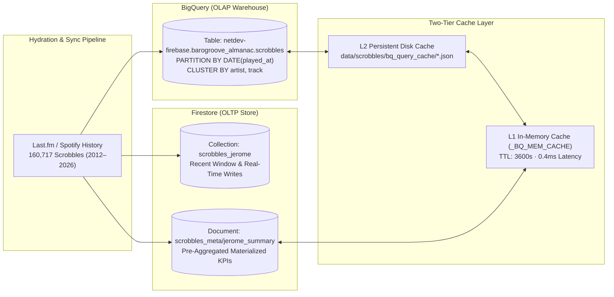

# 15-Year Scrobble Dual-Store & Two-Tier OLAP Cache Architecture

This document details the engineering design behind BAROGROOVE's **Dual-Store Musical Almanac** (`Firestore OLTP + BigQuery OLAP`) and its **Two-Tier Caching & Cost-Guardrail Engine** (`backend/app/almanac/scrobbles.py`).

---

## 1. The 15-Year Scrobble Hydration Problem

A musical history spanning nearly 15 years (`2012-03-04` to `2026-09-12`) contains **`160,717` individual scrobble events** across **`1,499` unique artists** and **`4,300` unique tracks**.

### Root-Cause Analysis of Early Ingestion Truncation (400-Scrobble Bottleneck)
Early Last.fm ingestion prototypes suffered from a `400`-scrobble ceiling due to three compounding factors:
1. **Pagination Window Cap**: Defaulting to `max_pages=2` at `200` tracks/page (`2 × 200 = 400`).
2. **Synchronous HTTP Request Loop**: Sequential page fetching without rate-limited async worker pools timed out on Cloud Run request lifecycles before historical pages could be reached.
3. **Firestore Single-Collection Scan Overhead**: Performing full-table aggregations (`GROUP BY artist`, `EXTRACT(HOUR FROM played_at)`, decade cross-tabs, and sonic DNA correlations) directly against `160,717` individual Firestore documents caused `O(N)` document read amplification and multi-second latency.

---

## 2. Dual-Store Architecture: Firestore (OLTP) + BigQuery (OLAP)

To achieve both **sub-millisecond document lookups** and **complex multi-dimensional analytical queries**, BAROGROOVE splits storage responsibilities across two specialized engines in Google Cloud project `netdev-firebase`:



### BigQuery Table Schema (`netdev-firebase.barogroove_almanac.scrobbles`)
- **Partitioning**: `PARTITION BY DATE(played_at)` — ensures time-bounded queries (e.g., specific years, seasons, or weather windows) prune unneeded partitions automatically.
- **Clustering**: `CLUSTER BY artist, track` — co-locates artist and track blocks for near-instant cohort cross-checking and top-artist aggregations.

| Column | Type | Description |
| :--- | :--- | :--- |
| `scrobble_id` | `STRING` | Deterministic hash key (`user_uts_artist_track`) preventing duplicate ingestion |
| `user` | `STRING` | Last.fm / BAROGROOVE user identifier (`jerome`) |
| `uts` | `INT64` | Unix epoch timestamp (seconds) |
| `played_at` | `TIMESTAMP` | UTC timestamp of playback |
| `artist` | `STRING` | Canonical artist name |
| `track` | `STRING` | Canonical track title |
| `album` | `STRING` | Album title |
| `year` | `INT64` | Extracted calendar year (`2012`–`2026`) |
| `month` | `INT64` | Extracted calendar month (`1`–`12`) |
| `hour` | `INT64` | Extracted hour of day (`0`–`23`) |
| `day_of_week` | `STRING` | Day name (`Monday`–`Sunday`) |
| `source` | `STRING` | Ingestion origin (`lastfm_full_history`, `spotify_recent`) |

---

## 3. Two-Tier Caching & Cost Guardrails (`$0.00` Execution Guarantee)

Every analytical query routed through `backend/app/almanac/scrobbles.py` is protected by a strict **Two-Tier Cache** and **BigQuery Cost Guardrails**:

### Tier 1 & Tier 2 Cache Resolution
1. **Normalized SHA-256 Cache Key**: Every SQL query or analytical request is normalized (whitespace-collapsed and parameter-bound) and hashed via SHA-256 (`_bq_cache_key(sql)`).
2. **L1 In-Memory Cache (`_BQ_MEM_CACHE`)**: Stores active query results in process memory with a 1-hour TTL (`_BQ_MEM_CACHE_TTL_SECONDS = 3600`). Hit latency: **`~0.4 ms`**.
3. **L2 Persistent Disk Cache (`data/scrobbles/bq_query_cache/` & `summary_cache.json`)**: Persists JSON results across server restarts and container deployments. Hit latency: **`~1.8 ms`**.

### BigQuery Cost & Attribution Guardrails
When a cache miss occurs and a live query is dispatched to BigQuery REST API:
- **Server-Side Query Cache**: `"useQueryCache": True` is enforced on every job configuration so BigQuery's own free cached result store is checked first.
- **Hard Byte-Billing Ceiling**: `"maximumBytesBilled": "104857600"` (100 MB ceiling) prevents any runaway scan from ever incurring unexpected cloud charges. Because the entire `160,717`-row table is ~24 MB uncompressed, all queries fall well within BigQuery's monthly free tier (`1 TB/month`).
- **Resource Attribution Label**: Every job is tagged with `"labels": {"datacloud": "jetski"}` for enterprise governance and FinOps tracking.

---

## 4. Cache Inspection & Management API

You can monitor cache hit ratios and clear caches via REST endpoints:

### Inspect Cache Statistics
```bash
GET /api/almanac/scrobbles/cache/stats
```
**Response Example:**
```json
{
  "l1_mem_entries": 12,
  "l2_disk_entries": 18,
  "hits_l1": 142,
  "hits_l2": 8,
  "misses_bq_executed": 2,
  "total_bytes_billed": 0,
  "cost_guardrail_bytes": 104857600,
  "summary_cache_loaded": true,
  "total_scrobbles": 160717
}
```

### Clear OLAP Cache
```bash
POST /api/almanac/scrobbles/cache/clear
```
Clears in-memory L1 entries and optional L2 disk query caches to force a fresh BigQuery warehouse sync.
