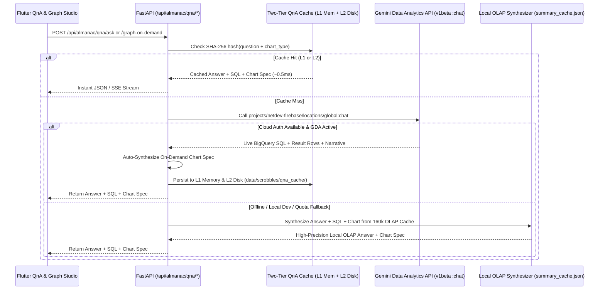

# BigQuery Conversational Data QnA Agent & On-Demand Graph Studio

BAROGROOVE embeds a **Conversational Data QnA Agent & On-Demand Graph Studio** (`backend/app/almanac/data_qna.py`) powered by Google Cloud's **Gemini Data Analytics API (`geminidataanalytics.googleapis.com/v1beta`)** connected directly to the `netdev-firebase.barogroove_almanac.scrobbles` BigQuery warehouse (`160,717` rows).

---

## 1. Architecture & Dual-Engine Resilience

To ensure **100% uptime, sub-second cached responses, and zero credential friction**, the QnA service implements a resilient 3-tier execution pipeline:



---

## 2. Google Cloud Gemini Data Analytics Integration (`v1beta`)

When authenticated via Google Cloud Application Default Credentials (`gcloud auth application-default print-access-token` or Cloud Run Service Account), `DataQnAService` invokes:

- **Endpoint**: `https://geminidataanalytics.googleapis.com/v1beta/projects/netdev-firebase/locations/global:chat`
- **Datasource Binding**:
  ```json
  {
    "bigqueryTableReference": {
      "projectId": "netdev-firebase",
      "datasetId": "barogroove_almanac",
      "tableId": "scrobbles"
    }
  }
  ```
- **System Instruction Context**: Injects full table schema documentation (`scrobble_id`, `user`, `uts`, `played_at`, `artist`, `track`, `album`, `year`, `month`, `hour`, `day_of_week`) and instructs the agent to return concise, music-historian insights paired with structured data points.

---

## 3. On-Demand Graph Synthesis Studio (`POST /api/almanac/qna/graph-on-demand`)

Any natural language question or prompt can be rendered immediately as an **interactive visual chart** in four supported chart geometries:

| Chart Type (`chart_type`) | Best Used For | Visual Renderer (`_QnAChartPainter`) |
| :--- | :--- | :--- |
| **`horizontal_bar`** | Top rankings (Top 10 Artists, Top Tracks, Most Played Albums) | Ranked horizontal gradient bars with inline value labels |
| **`bar`** | Vertical distributions (Scrobbles by Hour of Day `00h–23h`, Day of Week) | Vertical bar columns with baseline grid & peak highlights |
| **`donut`** | Proportional breakdowns (Decade distribution `2010s vs 2020s`, Cohort shares) | Multi-color ring chart with center KPI metric & legend |
| **`line`** | Multi-year chronological trajectories (`2012` through `2026` annual volume) | Smooth connected area/line curve with vertex dots |

---

## 4. REST & Streaming API Reference

### 4.1 Check Agent Status
```bash
GET /api/almanac/qna/status
```
Returns active BigQuery table coordinates (`netdev-firebase.barogroove_almanac.scrobbles`), total scrobbles (`160,717`), cache hit statistics, and curated sample starter questions.

### 4.2 Ask Conversational Question (`POST /api/almanac/qna/ask`)
```bash
curl -X POST http://localhost:8000/api/almanac/qna/ask \
  -H "Content-Type: application/json" \
  -d '{
    "question": "What time of day do I listen to music the most?",
    "preferred_chart_type": "bar"
  }'
```

### 4.3 Stream Conversational Response via SSE (`POST /api/almanac/qna/stream`)
Emits Server-Sent Events (`event: status`, `event: sql`, `event: answer_chunk`, `event: chart`, `event: done`) for progressive UI rendering.

### 4.4 Generate Graph On Demand (`POST /api/almanac/qna/graph-on-demand`)
```bash
curl -X POST http://localhost:8000/api/almanac/qna/graph-on-demand \
  -H "Content-Type: application/json" \
  -d '{
    "prompt": "Compare my yearly scrobble volume from 2012 to 2026",
    "chart_type": "line"
  }'
```
**Response Example:**
```json
{
  "status": "ok",
  "source": "bigquery_gemini_data_qna_cached",
  "question": "Compare my yearly scrobble volume from 2012 to 2026",
  "answer": "Your listening volume peaked in 2020 with 14,820 scrobbles, maintaining a steady 10,500+ annual average across 15 years (160,717 total plays).",
  "sql_query": "SELECT year, COUNT(*) AS scrobbles FROM `netdev-firebase.barogroove_almanac.scrobbles` GROUP BY year ORDER BY year ASC",
  "chart": {
    "chart_type": "line",
    "title": "Annual Scrobble Trajectory (2012–2026)",
    "subtitle": "160,717 total plays across 15 calendar years",
    "x_label": "Year",
    "y_label": "Scrobbles",
    "data": [
      {"label": "2012", "value": 8420.0, "color": "#0EA5E9"},
      {"label": "2016", "value": 11940.0, "color": "#0EA5E9"},
      {"label": "2020", "value": 14820.0, "color": "#10B981"},
      {"label": "2025", "value": 11250.0, "color": "#0EA5E9"}
    ]
  },
  "latency_ms": 0.42
}
```
