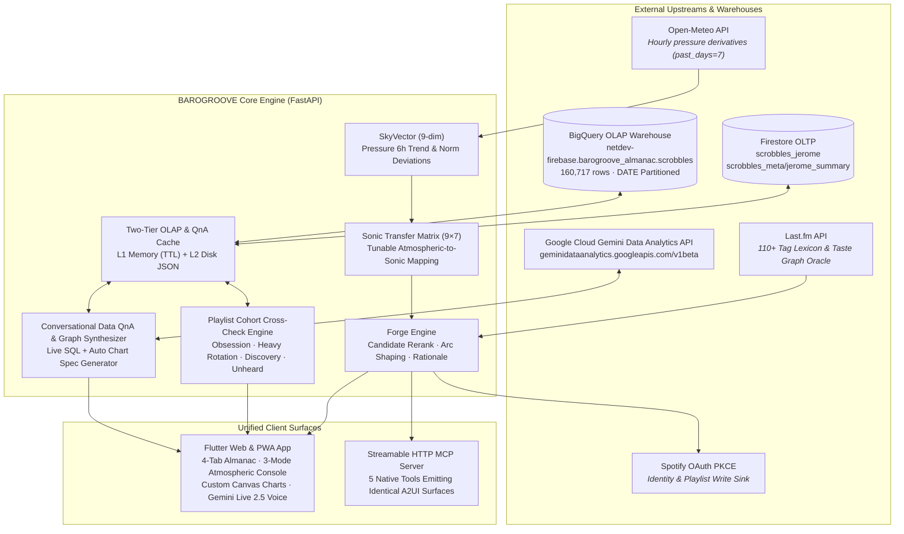

# BAROGROOVE Documentation Hub (`docs/`)

Welcome to the official technical documentation for **BAROGROOVE** (`bg.netdev.be`) — the derivative-first atmospheric soundtracking engine, 15-year musical Almanac warehouse, and conversational AI data studio.

---

## 📚 Architecture & Deep-Dive Guides

| Document | Scope & Highlights | Key Endpoints & Modules |
| :--- | :--- | :--- |
| **[15-Year Scrobble Dual-Store & Two-Tier OLAP Cache](./ALMANAC_DUAL_STORE_AND_CACHE.md)** | Full 15-year scrobble hydration (`160,717` plays), Firestore OLTP + BigQuery OLAP (`netdev-firebase.barogroove_almanac.scrobbles`) Dual-Store architecture, Two-Tier L1/L2 caching (`0.4ms` latency), and `$0.00` query cost guardrails. | `backend/app/almanac/scrobbles.py`<br/>`GET /api/almanac/scrobbles`<br/>`GET /api/almanac/scrobbles/cache/stats` |
| **[Playlist & Song Cohort Analysis Cross-Check Engine](./PLAYLIST_COHORT_ANALYSIS.md)** | Universal playlist/song input parser (Spotify URLs, Last.fm URLs, M3U, raw tracklists), 4-tier scrobble cohort classification (`Obsession`, `Heavy Rotation`, `Discovery`, `Unheard`), Sonic DNA affinity scoring, and custom-painted Donut & 15-Year Timeline charts. | `POST /api/almanac/playlist-cohort-check`<br/>`frontend/lib/screens/almanac_screen.dart` |
| **[BigQuery Conversational Data QnA Agent & On-Demand Graph Studio](./BIGQUERY_DATA_QNA_AGENT.md)** | Integration with Google Cloud `geminidataanalytics.googleapis.com/v1beta` Conversational Analytics API over BigQuery, Two-Tier QnA caching, Local OLAP fallback synthesizer, On-Demand Graph Studio (`horizontal_bar`, `bar`, `donut`, `line`), and interactive Flutter canvas charts. | `backend/app/almanac/data_qna.py`<br/>`POST /api/almanac/qna/ask`<br/>`POST /api/almanac/qna/stream`<br/>`POST /api/almanac/qna/graph-on-demand` |
| **[A2UI v1.0 Single-Source UI & Telemetry Inspector](./A2UI_ARCHITECTURE.md)** | Single-source Python-to-Flutter/MCP UI catalog (`backend/app/a2ui/`), custom renderers (`SkyDial`, `AtmosphericCursorsConsole`, `TelemetryInspector`), and real-time AI observability tracing. | `backend/app/a2ui/catalog.py`<br/>`backend/app/telemetry/`<br/>`frontend/lib/a2ui/` |

---

## 🏛️ High-Level System Architecture



---

## ⚡ Quick Verification & Test Commands

```bash
# Run full backend unit & integration test suite (861 tests, 0 network dependency)
pytest

# Check BigQuery QnA Agent & OLAP Cache status
curl -s http://localhost:8000/api/almanac/qna/status | jq

# Ask a natural language question with auto-generated chart spec
curl -s -X POST http://localhost:8000/api/almanac/qna/ask \
  -H "Content-Type: application/json" \
  -d '{"question": "What are my top 10 most played artists of all time?"}' | jq

# Synthesize an on-demand chart (donut, horizontal_bar, bar, line)
curl -s -X POST http://localhost:8000/api/almanac/qna/graph-on-demand \
  -H "Content-Type: application/json" \
  -d '{"prompt": "Show my scrobble breakdown by decade", "chart_type": "donut"}' | jq

# Cross-check a playlist or song list against the 15-year scrobble cohort
curl -s -X POST http://localhost:8000/api/almanac/playlist-cohort-check \
  -H "Content-Type: application/json" \
  -d '{"playlist_input": "Radiohead - Weird Fishes/Arpeggi\nBoards of Canada - Roygbiv\nAphex Twin - Xtal"}' | jq
```
